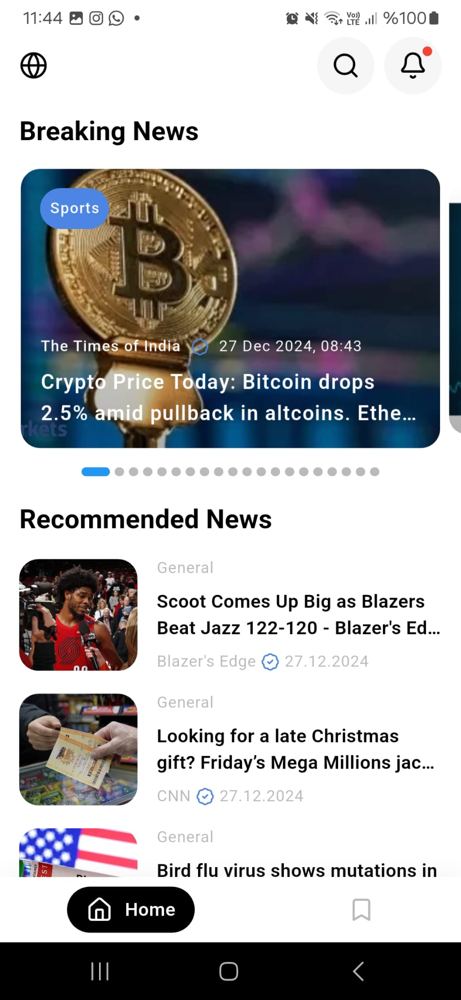
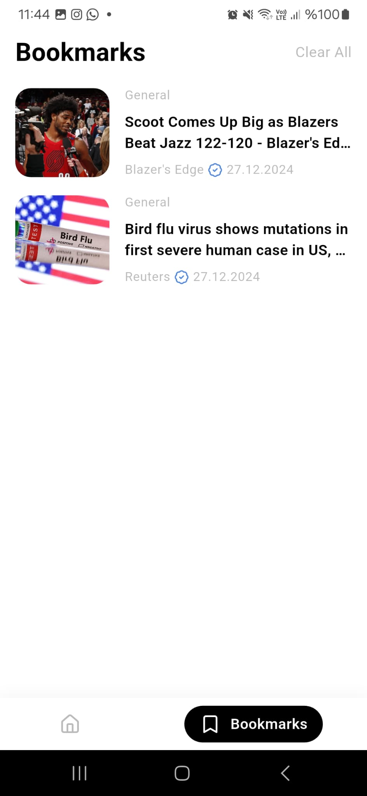
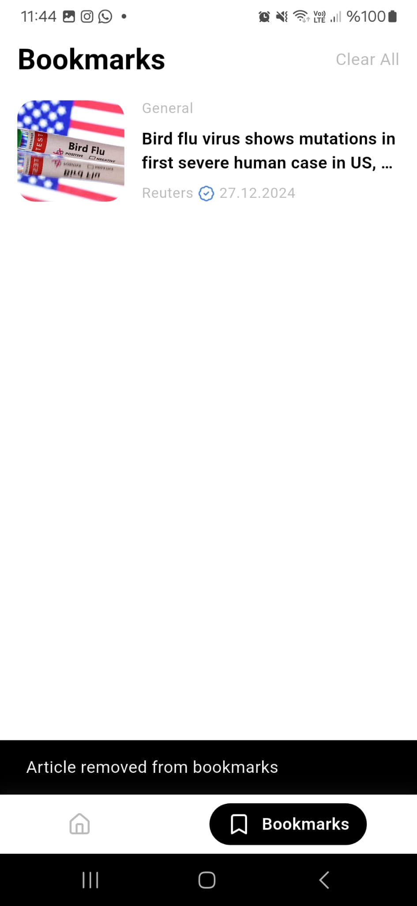

# News App Flutter

A modern news application built with Flutter that allows users to browse news articles, bookmark their favorites, and stay updated with the latest headlines.

## Features

- Browse latest news articles
- Bookmark favorite articles
- Remove bookmarks with swipe gesture
- Clean and modern UI
- Localization support (English/Turkish)
- Firebase integration
- Responsive design

## Screenshots

  
   
  
  

## Architecture

This project follows Clean Architecture principles and is organized into the following layers:

- Presentation (UI)
- Domain (Business Logic)
- Data (Repository Implementation)

### State Management

- BLoC pattern using flutter_bloc
- Cubit for simpler state management cases

## Features in Detail

### Bookmarks

- Save articles for later reading
- Swipe to delete bookmarks
- Persistent storage using Hive
- Undo bookmark removal

### Localization

- Supports multiple languages
- Easy to add new translations
- Currently supports English and Turkish

## Contributing

Contributions are welcome! Please feel free to submit a Pull Request.

## License

This project is licensed under the MIT License - see the LICENSE file for details
